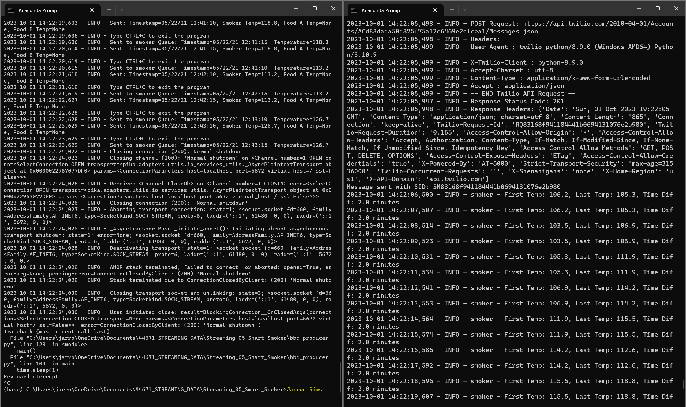
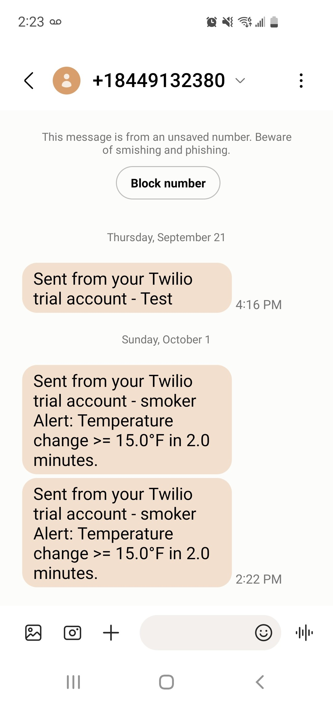

# Project Title: streaming-05-smart-smoker
### Author: Jarrod Sims
### Date: 9/24/23

This project implements a data producer for streaming sensor data from a smart smoker system. The sensor data is stored in a CSV file, and the producer reads this data and sends it to RabbitMQ queues. The data includes temperature readings for the smoker itself and two food items (Food A and Food B), with readings taken every 30 seconds. A single consumer is used to monitor three different queues, perform analytics, and raise alerts for specific temperature conditions. 

## Getting Started
Before running the producer, ensure the following requirements are met:

- RabbitMQ server is running.
- The `pika` library is installed in your active Python environment.
- Create a Twilio account

## Getting Started with Twilio
1. Sign Up for Twilio:
    - Go to the Twilio website: https://www.twilio.com/.
    - Click the "Get started for free" button.
    - Fill out the registration form to create an account.

2. Verify Your Phone Number:
    - After signing up, Twilio may ask you to verify your phone number for security purposes. Follow the on-screen instructions to complete this step.

3. Access Your Twilio Dashboard:
    - Once your account is set up, log in to your Twilio dashboard.

4. Obtain Your Twilio Account SID and Auth Token:
    - On the dashboard, you will see your Twilio Account SID and Auth Token. Keep these values handy as you'll need them to authenticate your requests to Twilio's API.

5. Get a Twilio Phone Number:
    - In your Twilio dashboard, go to the "Phone Numbers" section.
    - Click the "Get a Trial Number" button or purchase a Twilio phone number based on your requirements.

6. Install the Twilio Python Library:
    - To install the Twilio Python library. You can do this using pip:
      `pip install twilio`

7. Update twilio config file:
    - Update `config.txt` with your Twilio account creditentials

## The key features of this project include:
- Reading sensor data from the CSV file.
- Sending data to RabbitMQ queues.
- Simulating sensor data streaming.
- Receiving sensor data from multiple RabbitMQ queues using a consumer
- Sending text alerts

## How to Use

1. Clone this repository to your local machine.
2. Make sure RabbitMQ is running.
3. Update the `config.txt` file with your Twilio account credentials
4. Install the `pika` library if not already installed (`pip install pika`).
5. Install the `twilio` library if not already installed (`pip install twilio`).
6. Execute the `bbq_producer.py` script.
7. The RabbitMQ Admin website will automatically open for queue monitoring (optional).
    - Set the value of `SHOW_OFFER` variable to false to disable this feature.
8. The producer will start sending sensor data to the specified queues with a frequency of one every 30 seconds.
9. Execute the `bbq_consumer.py` script.

## Reference
- [RabbitMQ Tutorial - Work Queues](https://www.rabbitmq.com/tutorials/tutorial-two-python.html)

## The following modules are used in this project:
- csv	
- webbrowser
- signal	
- sys	
- time	
- pika
- socket
- twilio

## Prerequisites
- Git
- Python 3.10+ 
- VS studio Code 
- anaconda prompt (miniconda3)
- RabbitMQ

## Producer and Consumer Running in Terminal Screenshot

## Temperature Change Text Alert Screenshot

## RabbitMQ Admin Queue Monitoring Screenshot:

## Credits
- Dr. Denise Case
- ChatGPT
