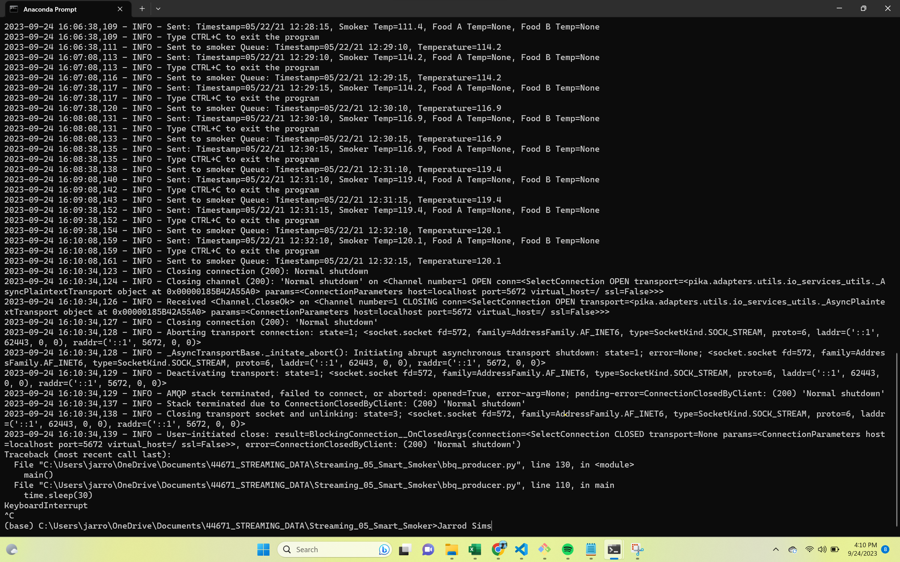
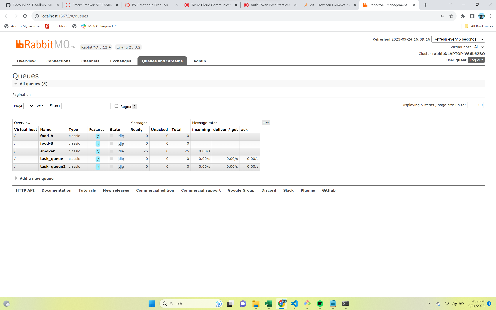

# Project Title: streaming-05-smart-smoker
### Author: Jarrod Sims
### Date: 9/24/23

This project implements a data producer for streaming sensor data from a smart smoker system. The sensor data is stored in a CSV file, and the producer reads this data and sends it to RabbitMQ queues. The data includes temperature readings for the smoker itself and two food items (Food A and Food B), with readings taken every 30 seconds.

## Getting Started
Before running the producer, ensure the following requirements are met:

- RabbitMQ server is running.
- The `pika` library is installed in your active Python environment.

## The key features of this project include:
- Reading sensor data from the CSV file.
- Sending data to RabbitMQ queues.
- Simulating sensor data streaming.

## How to Use

**To use the producer, follow these steps:**

1. Clone this repository to your local machine.
2. Make sure RabbitMQ is running.
3. Install the `pika` library if not already installed (`pip install pika`).
4. Execute the `bbq_producer.py` script.
5. The RabbitMQ Admin website will automatically open for queue monitoring (optional).
    - Set the value of `SHOW_OFFER` variable to false to disable this feature.
6. The producer will start sending sensor data to the specified queues with a frequency of one every 30 seconds.

## Reference
- [RabbitMQ Tutorial - Work Queues](https://www.rabbitmq.com/tutorials/tutorial-two-python.html)

## The following modules are used in this project:
- csv	
- webbrowser
- signal	
- sys	
- time	
- pika
- socket

## Prerequisites
- Git
- Python 3.10+ 
- VS studio Code 
- anaconda prompt (miniconda3)
- RabbitMQ

## Producer Running in Terminal Screenshot

## RabbitMQ Admin Queue Monitoring Screenshot:

## Credits
- Dr. Denise Case
- ChatGPT
